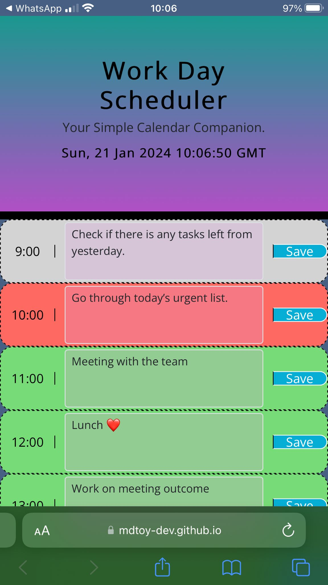

# 9to5Planner

## Description

9to5Planner is a simple calendar application designed to help you efficiently schedule your workday. With dynamic updates and an intuitive interface, managing your time has never been easier.

## Features

- **Current Day Display:** The app prominently displays the current day at the top for quick reference.

- **Timeblocks:** Timeblocks for standard business hours are presented as you scroll down, allowing you to plan your day effectively.

- **Color-Coded Timeblocks:** Each timeblock is color-coded based on past, present, and future, providing visual cues for better organization.

- **Event Entry:** Easily enter and edit events by clicking on the respective timeblock.

- **Local Storage:** Your entered events are saved in local storage, persisting between page refreshes.

## Link

[Access Website](https://mdtoy-dev.github.io/9to5Planner/) 

## Usage

- Click on a timeblock to enter or edit an event.
- Save your event by clicking the "Save" button.
- Your events will be saved in local storage.

## Contribution Guidelines

If you would like to contribute to the project, please follow these steps:

1. Fork the repository.
2. Create a new branch for your feature: `git checkout -b feature-name`
3. Commit your changes: `git commit -m 'Add new feature'`
4. Push to the branch: `git push origin feature-name`
5. Submit a pull request.

## License

This project is licensed under the [MIT License](LICENSE).

